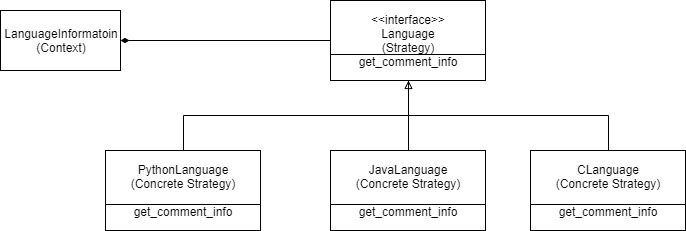

# CapitalOne-Coding

This repo contains code to count single line comments, block comments, lines of block comment and TODOs within comments. Link to the Technical Assessment can be found [here](www.abdullahsumbal.com/doc/capital-one.pdf).

The project can count comments and TODOs for the following languages:

- [x] Python
- [x] Java
- [x] C
- [x] C++
- [x] C#
- [x] Javascript

## Getting started

### Prerequisites

1. Install [anaconda](https://www.anaconda.com/distribution/).
2. step up python environment
    ```buildoutcfg
    conda create --name language-info python=3.6
    ``` 
3. activate environment
    ```buildoutcfg
    conda activate language-info
    or 
    source activate language-info
    ```

### Installation
There are no requirements for this project.

Note: In future, If there are any dependencies, please add them in the `requirements.txt` file and use the following command to install.
```buildoutcfg
conda install -c conda-forge --file requirements.txt

or 

pip install -r requirements.txt

```
### Run Application 
The application takes in a configuration json file as an argument. In this configuration file, 
you can define allowed languages and their extensions and also a path to 
source code directory. There is a template configuration placed in the root folder called 
[template-config.json](template-config.json). If you do not provide any argument, the 
program takes [template-config.json](template-config.json) as a default configuration file. 
Please point the `source_directory` value in the configuration file to the desired source 
file directory.
Run the following command on terminal.
```buildoutcfg
python main.py
```

The following shows the `-h` output.

```buildoutcfg
$>python main.py -h
usage: main.py [-h] [-c CONFIG_PATH]

Count Comments

optional arguments:
  -h, --help            show this help message and exit
  -c CONFIG_PATH, --config_path CONFIG_PATH
                        provide an config file (default: template-config.json)

```
### How it works
The input to the program is a configuration file. The `source_directory` variable contains the address of the source code files. The program will go inside the
`source_directory` and get grab all the files. Then, it will filter files with extension defined in the configuration file. All filtered files will 
go to their language specific implementation to get comments and TODOs counts.

The program is able to complex cases such as 

```buildoutcfg
"/* This is not a comment because it is in a string */"
``` 

The program has the following output format:
```buildoutcfg
File Name: data-samples\cplus-file.cpp
Total # of lines: 28
Total # of comment lines: 8
Total # of single line comments: 1
Total # of comment lines within block comments: 7
Total # of block line comments: 2
Total # of TODO’s: 1

```

### Program Architecture
The project uses the strategy design pattern. The image below shows the architecture of the program.

 

The Strategy pattern suggests that you take a class that does something specific in a lot of different ways and extract all of these algorithms into separate classes called strategies.

The original class, called `LanguageInformation`, must have a field for storing a reference to one of the strategies (e.g. `JavaLanguage`). The `LanguageInformation` delegates the work to a linked strategy (e.g. `JavaLanguage`) object instead of executing it on its own.

The `LanguageInformation` isn’t responsible for selecting an appropriate language to get the comment info. Instead, the client passes the desired strategy (e.g. `JavaLanguage`) to the `LanguageInformation`. In fact, the `LanguageInformation` doesn’t know much about strategies. It works with all strategies through the same generic interface, which only exposes a single method for triggering the algorithm encapsulated within the selected strategy.

I used the strategy pattern because I wanted to use different variants of an `get_comment_info` within an object and be able to switch from one `get_comment_info` to another during runtime depending file extension.

### Important notes:
Comment formatting for C, Java, C++, C# and Javascript is similar. Therefore I implemented a `get_comment_info_common` function in `Language` interface class. This saves from code duplication.
It is important to have implementation of languages with similar comment formatting because it will help in scalability of the project. 
For example, what if we wanted to implement a function for counting loops for every language. This project is capable of doing more analysis then just
counting comments.
 
